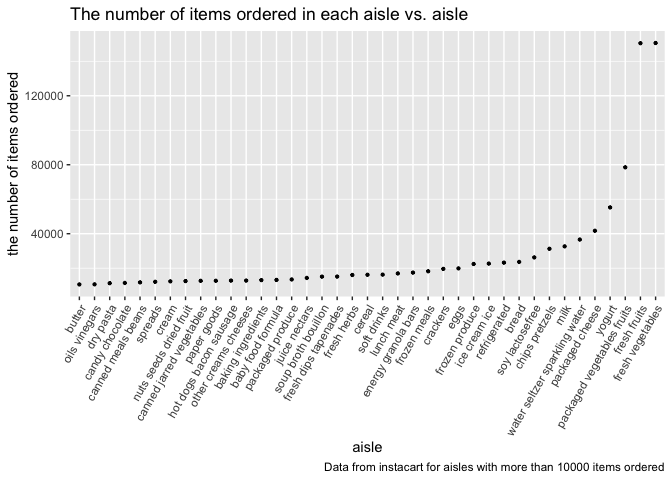
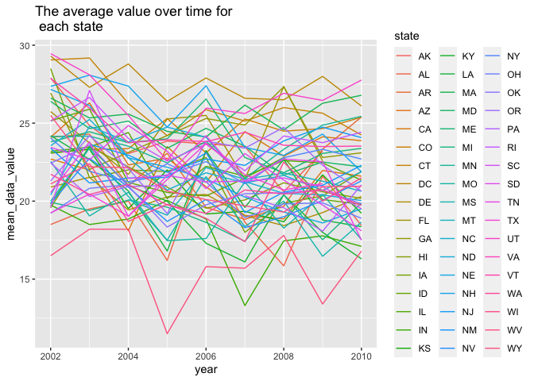
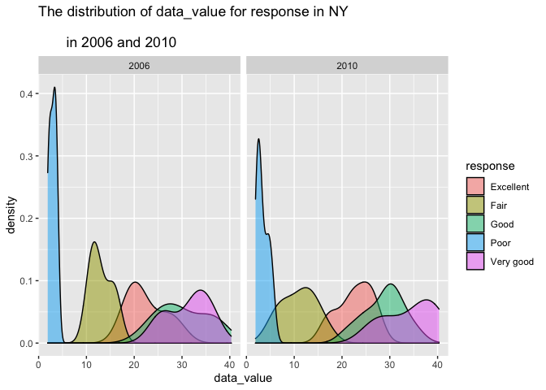
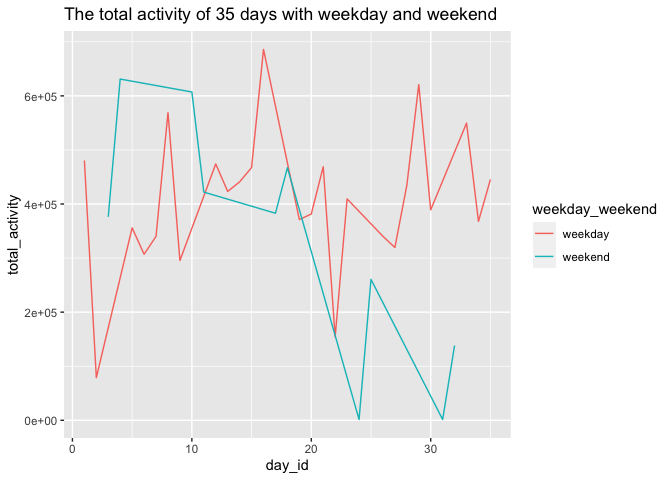
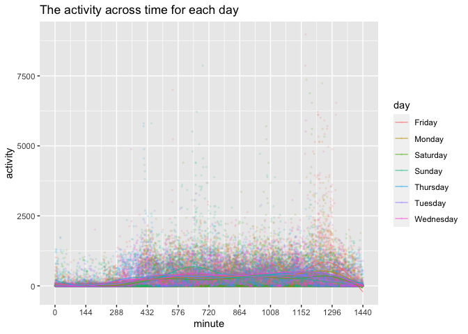

p8105\_hw3\_yw3773
================

``` r
library(tidyverse)
library(lubridate)
```

# Problem 1

``` r
library(p8105.datasets)
data("instacart") 
```

The Instacart data set contains 15 columns and 1384617 rows. The data
sets has 15 variables which are order\_id, product\_id,
add\_to\_cart\_order, reordered, user\_id, eval\_set, order\_number,
order\_dow, order\_hour\_of\_day, days\_since\_prior\_order,
product\_name, aisle\_id, department\_id, aisle, department. Some of the
key variables we are especially interested here include:

-   “order\_dow”: the day of the week on which the order was placed. The
    number 0 to 6 represent Sunday to Saturday.

-   “order\_hour\_of\_day”: the hour of the day on which th order was
    placed (within 24 hours).

-   “product\_name”: the name of the product. For example, Spring Water,
    Bulgarian Yogurt.

-   “aisle”: the name of the aisle. For example, fresh vegetables, lunch
    meat.

### most items ordered from aisle

``` r
unique_aisles = unique(pull(instacart, aisle))
num_aisles = length(unique_aisles)
tail(sort(table(pull(instacart, aisle))),1)
```

    ## 
    ## fresh vegetables 
    ##           150609

There are a total of `num_aisles` aisles, the aisle that the most items
ordered from is fresh vegetables.

### the number of items ordered in each aisle

``` r
instacart %>%
  group_by(aisle) %>%
  summarize(n_obs = n()) %>%
  filter(n_obs > 10000) %>%
  mutate(aisle = fct_reorder(aisle, n_obs)) %>%
  arrange(desc(n_obs)) %>%
  ggplot(aes(aisle, n_obs)) + geom_point(size = 0.8) +
  ggtitle("The number of items ordered in each aisle vs. aisle") +
  labs(y = "the number of items ordered", x = "aisle", 
       caption = "Data from instacart for aisles with more than 10000 items ordered") +
  theme(axis.text.x = element_text(angle = 60, hjust = 1) )
```

<!-- -->

### the three most popular items in each of the aisles

``` r
## backing ingredients
baking_data = instacart %>%
  filter(aisle == "baking ingredients") 
most_pop_baking = as.data.frame(table(pull(baking_data, product_name))) %>%
  arrange(Freq) %>%
  filter(Freq > 335) %>%
  mutate(aisle = "baking ingredients")

## dog food care
dog_data = instacart %>%
  filter(aisle == "dog food care") 
most_pop_dog = as.data.frame(table(pull(dog_data, product_name))) %>%
  arrange(Freq) %>%
  filter(Freq > 25) %>%
  mutate(aisle = "dog food care")

## packaged veg
veg_data = instacart %>%
  filter(aisle == "packaged vegetables fruits") 
most_pop_veg = as.data.frame(table(pull(veg_data, product_name))) %>%
  arrange(Freq) %>%
  filter(Freq > 4965) %>%
  mutate(aisle = "packaged vegetables fruits")

## combine them
com_most_pop = rbind(most_pop_baking, most_pop_dog, most_pop_veg) 
colnames(com_most_pop) = c("product", "num", "aisle")
com_most_pop = com_most_pop[,c(3,1,2)]

knitr::kable(com_most_pop)
```

| aisle                      | product                                       |  num |
|:---------------------------|:----------------------------------------------|-----:|
| baking ingredients         | Cane Sugar                                    |  336 |
| baking ingredients         | Pure Baking Soda                              |  387 |
| baking ingredients         | Light Brown Sugar                             |  499 |
| dog food care              | Small Dog Biscuits                            |   26 |
| dog food care              | Organix Chicken & Brown Rice Recipe           |   28 |
| dog food care              | Snack Sticks Chicken & Rice Recipe Dog Treats |   30 |
| packaged vegetables fruits | Organic Blueberries                           | 4966 |
| packaged vegetables fruits | Organic Raspberries                           | 5546 |
| packaged vegetables fruits | Organic Baby Spinach                          | 9784 |

The top three most popular items in “baking ingredients” are cane sugar,
pure baking soda and light brown sugar. The top three most popular items
in “dog food care” are small dog biscuits, organix chicken & brown rice
recipe, snack sticks chicken & rice recipe dog treats. The top three
most popular items in “packaged vegetables fruits” are organic
blueberries, organic raspberries and organic baby spinach.

### the mean hour of the day at which Pink Lady Apples and Coffee Ice Cream

``` r
week_hour_df = instacart %>%
  select(product_name, order_dow, order_hour_of_day) %>%
  filter(product_name == "Pink Lady Apples" | 
           product_name == "Coffee Ice Cream" ) %>%
  group_by(product_name, order_dow) %>%
  summarize(mean_hour = mean(order_hour_of_day)) %>%
  mutate(order_dow = order_dow + 1) %>% 
  mutate(order_dow  = wday(order_dow, label = TRUE)) %>%
  pivot_wider(names_from = order_dow, values_from = mean_hour)

knitr::kable(week_hour_df)
```

| product\_name    |      Sun |      Mon |      Tue |      Wed |      Thu |      Fri |      Sat |
|:-----------------|---------:|---------:|---------:|---------:|---------:|---------:|---------:|
| Coffee Ice Cream | 13.77419 | 14.31579 | 15.38095 | 15.31818 | 15.21739 | 12.26316 | 13.83333 |
| Pink Lady Apples | 13.44118 | 11.36000 | 11.70213 | 14.25000 | 11.55172 | 12.78431 | 11.93750 |

For Pink Lady Apples, the day with the highest mean hour is Tuesday
which is 15.38. For Coffee Ice Cream, the day with the highest mean hour
is Wednesday which is 14.25.

# Problem 2

``` r
library(p8105.datasets)
data("brfss_smart2010") 
```

``` r
# data cleaning
brfss_smart2010 = brfss_smart2010 %>%
  janitor::clean_names() %>%
  filter(topic == "Overall Health") %>%
  filter(response %in% c("Poor","Fair", "Good", "Very good", "Excellent")) %>%
  mutate(response = as.factor(response)) %>%
  mutate(state = locationabbr) %>%
  select(-locationabbr)
```

### which states were observed at 7 or more locations

``` r
state_02 = brfss_smart2010 %>%
  filter(year == 2002) %>%
  group_by(state) %>%
  summarize(count = n_distinct(locationdesc)) %>%
  filter(count >= 7)

state_10 = brfss_smart2010 %>%
  filter(year == 2010) %>%
  group_by(state) %>%
  summarize(count = n_distinct(locationdesc)) %>%
  filter(count >= 7)
```

In 2002, the sates that were observed at 7 or more locations are CT, FL,
MA, NC, NJ, PA. In 2010, the states that were observed at 7 or more
locations are CA, CO, FL, MA, MD, NC, NE, NJ, NY, OH, PA, SC, TX, WA.

### excellent response only, data\_value over years

``` r
excellent_df = brfss_smart2010 %>%
  filter(response == "Excellent") %>%
  group_by(state) %>%
  summarize(mean_data_value = mean(data_value, na.rm = TRUE)) 

knitr::kable(head(excellent_df))
```

| state | mean\_data\_value |
|:------|------------------:|
| AK    |          23.57273 |
| AL    |          18.55000 |
| AR    |          21.86190 |
| AZ    |          21.41250 |
| CA    |          23.32308 |
| CO    |          24.38814 |

``` r
brfss_smart2010 %>%
  filter(response == "Excellent") %>%
  group_by(state, year) %>%
  summarize(mean_data_value = mean(data_value)) %>%
  ggplot(aes(x = year, y = mean_data_value, color = state)) + 
  geom_line() +
  labs(title = "The average value over time for \n each state") 
```

    ## Warning: Removed 3 row(s) containing missing values (geom_path).

<!-- -->

From the constructed data set, the state with the highest average
data\_value across locations is DC. From the “spaghetti” plot we can see
that most of the average values across time are around 22.5.

### distribution of data\_value for responses (“Poor” to “Excellent”) among locations in NY State.

``` r
brfss_smart2010 %>%
  filter(year == 2006 | year == 2010, state == "NY") %>%
  ggplot(aes(x = data_value, fill = response)) +
  geom_density(alpha = 0.5) +
  facet_grid(.~year) +
  labs(title = "The distribution of data_value for response in NY \n 
       in 2006 and 2010")
```

<!-- -->

From the two plots, we can see that most of the distributions are
approximate normal, except the distributions of the poor response.

# Problem 3

### data cleaning

``` r
# data cleaning
acce_data = read_csv("accel_data.csv") %>%
  janitor::clean_names() %>%
  mutate(weekday_weekend = ifelse(day %in% c("Saturday", "Sunday"), "weekend", "weekday")) %>%
  select(week, day_id, day, weekday_weekend, everything())
```

The resulting data contain 1444 columns which includes week, day\_id,
day, weekday\_weekend, and 1440 activity counts for each minute of a
24-hour day starting at midnight. It contain 35 rows which are the
number of days observed.

### total activity for each day

``` r
total_act_df = acce_data %>%
  pivot_longer(activity_1:activity_1440, 
               names_to = "minute", 
               names_prefix = "activity_", 
               values_to = "activity") %>%
  mutate(minite = as.numeric(minute)) %>%
  group_by(day_id, weekday_weekend) %>%
  summarize(total_activity = sum(activity))

knitr::kable(head(total_act_df))
```

| day\_id | weekday\_weekend | total\_activity |
|--------:|:-----------------|----------------:|
|       1 | weekday          |       480542.62 |
|       2 | weekday          |        78828.07 |
|       3 | weekend          |       376254.00 |
|       4 | weekend          |       631105.00 |
|       5 | weekday          |       355923.64 |
|       6 | weekday          |       307094.24 |

``` r
total_act_df %>% 
  ggplot(aes(x = day_id, y = total_activity, color = weekday_weekend)) +
  geom_line() + labs(title = "The total activity of 35 days with weekday and weekend")
```

<!-- -->

There is no very obvious trend that I can see, I tried to plot a graph
of he total activity of 35 days with weekday and weekend, most of the
total activities in weekends are lower than weekdays

### 24-hour activity time for each day

``` r
acce_data %>%
  pivot_longer(activity_1:activity_1440, 
               names_to = "minute", 
               names_prefix = "activity_", 
               values_to = "activity") %>%
  mutate(minute = as.numeric(minute)) %>%
  ggplot(aes(x = minute, y = activity, color = day)) + geom_point(alpha = 0.1, size = 0.5) +
  scale_x_continuous(
    breaks = c(seq(from = 0, to = 1440, by = 144)),
    labels = c((seq(from = 0, to = 1440, by = 144)))
  ) + geom_smooth(se = FALSE, size = 0.3) +
  labs(title = "The activity across time for each day")
```

<!-- -->

From the plot we can see that the activity tends to be higher during the
morning 9 AM to 12 PM and also during the evening from 8:30 PM to 11 PM.
